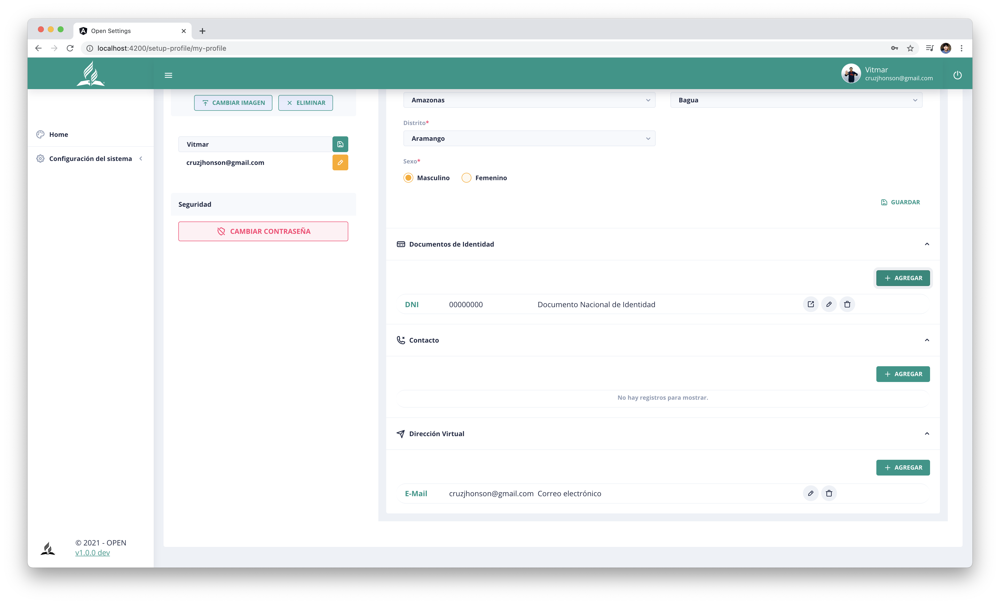

# OpenSettingsSrc

Quickstart, de proyecto con Angular & Laravel. Código abierto, si necesitan asesoría comunicarse con el autor.

## Página del login

        

## Módulo de perfil de usuario

        

## Módulo de personas

        

## Recuperación de personas

        

## Pagína de registro

        

## Acceso de roles

        

## Perfil de usuario

        

## Perfil de usuario 2

        

## Módulo de usuarios

        

## Verificación de emails

        

## Acceso de módulos

        

## Página de confirmación de email

        

## Proyecto complemetado con:

- open-settings-api (https://github.com/open-way/open-settings-api)

## Créditos

- Vitmar j. Aliaga Cruz (https://linktr.ee/vitmaraliaga).
